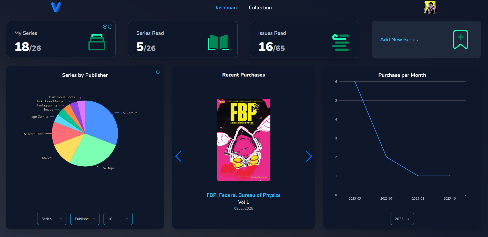
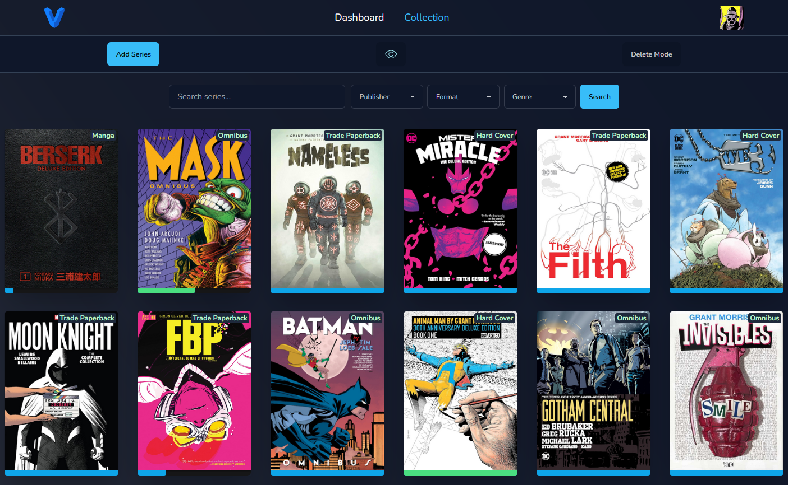
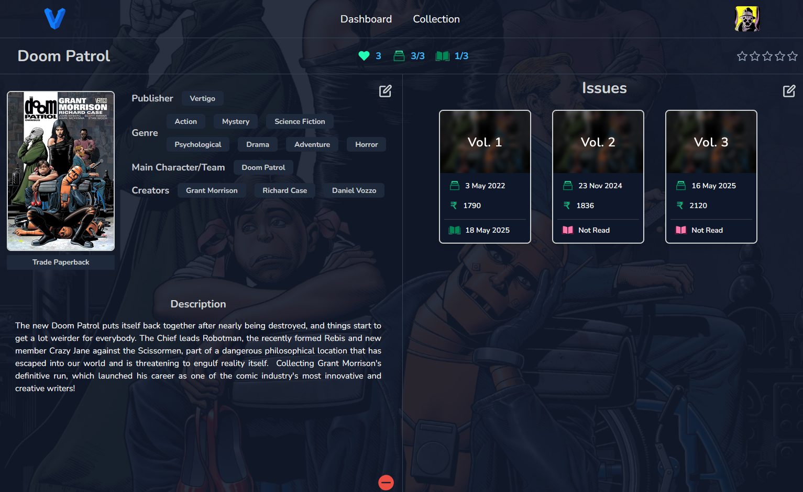

<div align="center">

  
  <h3 align="center">Vertigo</h3>

  <p align="center">
    Vertigo is a self-hosted web app designed to help you catalogue and track your comic book collection with ease. Created using <a href="https://vuejs.org/">Vue.js</a> and <a href="https://flask.palletsprojects.com/en/3.0.x/">Flask</a>
  </p>
 
  <p align='center'>
    <h3 align="center">Dashboard</h3>

</p>

  <p align='center'>
    <h3 align="center">Collection View</h3>

</p>

  <p align='center'>
    <h3 align="center">Series View</h3>

</p>
 <br />
</div>

> **⚠ Disclaimer ⚠**: Vertigo is WIP and under active development. Expect occasional bugs, incomplete features, and potential breaking changes as I add new features and improve functionality.

## Goals:

- [x] A responsive modern web app to track and curate physical comicbook collection
- [x] Search and filter options based on various criteria such as title, publisher etc.
- [x] Track reading progress (read/unread, backlog and ratings if needed).
- [x] Generate insightful statistics on collection.
- [x] Export User Data to commonly used formats like spreadsheets.
- [ ] Explore options to integrate with external APIs for automatic fetching of details.

Feel free to reach out if you have anything else you'd like to see!

## Getting Started:

Vertigo has now entered its **Alpha release** stage! You can try it out by downloading the latest ZIP from the [releases section](https://github.com/anonhacker47/vertigo/releases).

After extracting the ZIP, run the app using the appropriate script for your operating system:

- **Linux**:  
  Run `launch.sh`

- **Windows**:  
  Run `launch.bat`

This will set up and launch the webapp in http://localhost:6166
<br/>

## Developer Guide:

#### Prerequisites:

- Python 3 (https://www.python.org/downloads/)
- Node.js and npm (https://nodejs.org/)

### Clone the repository

```bash
git clone https://github.com/anonhacker47/vertigo-comic-collection -b main
cd vertigo-comic-collection
```

### Setup

Set up a Python 3 virtualenv and install the dependencies on it:

```bash
cd vertigo-backend
python3 -m venv venv
source venv/bin/activate
pip install -r requirements.txt
```

Create the db and run flask app:

```bash
alembic upgrade head
flask run
```

By default, You can try out the app from http://localhost:5000/ .
<br/>
<br/>

> If you want to tinker with the Frontend follow the below instructions.

#### Frontend Setup

Install the dependencies:

```bash
cd vertigo-ui
npm install
```

Run the Vue.js frontend:

```bash
npm run dev
```

Voila! you can find the frontend at http://localhost:5173/

<br/>

## Acknowledgements

- **[Miguel Grinberg Microblog API](https://github.com/miguelgrinberg/microblog-api)**
